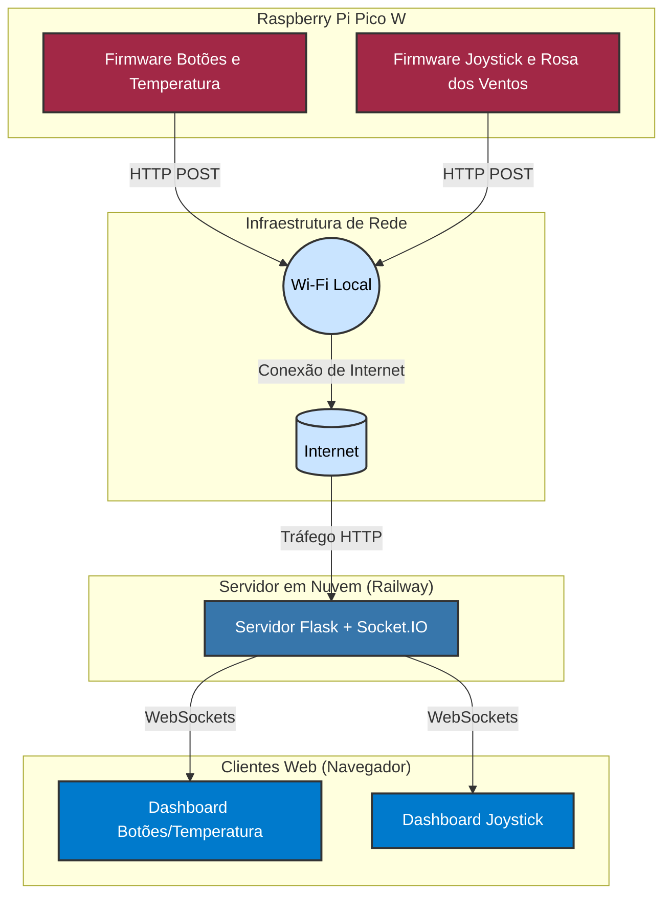

# Projeto Integrado de Monitoramento IoT com Raspberry Pi Pico W e Servidor em Nuvem

<p align="center">
  <!-- Logos podem ser um pouco menores e mais centralizados se desejar, ou como estão -->
  &nbsp;
  &nbsp;
  &nbsp;
  &nbsp;
  &nbsp;
  
</p>

---

## Sumário

1.  [Introdução](#1-introdução)
2.  [Visão Geral da Arquitetura](#2-visão-geral-da-arquitetura)
    *   [Diagrama da Arquitetura](#diagrama-da-arquitetura)
3.  [Funcionalidades Detalhadas](#3-funcionalidades-detalhadas)
4.  [Tecnologias Empregadas](#4-tecnologias-empregadas)
5.  [Estrutura do Repositório](#5-estrutura-do-repositório)
6.  [Pré-requisitos](#6-pré-requisitos)
7.  [Configuração e Instruções de Execução](#7-configuração-e-instruções-de-execução)
    *   [7.1. Configuração do Servidor na Plataforma Railway](#71-configuração-do-servidor-na-plataforma-railway)
    *   [7.2. Configuração e Compilação dos Firmwares](#72-configuração-e-compilação-dos-firmwares)
    *   [7.3. Acesso aos Dashboards](#73-acesso-aos-dashboards)
8.  [Estrutura dos Dados Transmitidos](#8-estrutura-dos-dados-transmitidos)
9.  [Dicas](#9-dicas)
10. [Licença](#10-licença)
11. [Visualização do Projeto](#11-visualização-do-projeto)

---

## 1. Introdução

Este projeto detalha a concepção e implementação de um sistema de Internet das Coisas (IoT) ponta-a-ponta. O sistema abrange a aquisição de dados de sensores e entradas de usuário, utilizando o microcontrolador Raspberry Pi Pico W, e a subsequente transmissão desses dados para um servidor hospedado em nuvem, permitindo a visualização e monitoramento em tempo real. A arquitetura modular consiste em dois firmwares distintos para o microcontrolador e uma aplicação de servidor web robusta.

Este documento serve como um guia técnico abrangente, fornecendo todas as informações necessárias para a compreensão, configuração, compilação e execução de cada componente do projeto.

## 2. Visão Geral da Arquitetura

O sistema é arquitetonicamente segmentado em três componentes primários, interagindo para prover a funcionalidade completa:

*   **Firmware de Monitoramento de Botões e Temperatura (`/butoes`):**
    Desenvolvido em linguagem C e operando sobre o Sistema Operacional de Tempo Real (RTOS) FreeRTOS, este firmware é executado no Raspberry Pi Pico W. É responsável pela leitura do estado de dois botões físicos e pela aquisição da temperatura ambiente através do sensor interno do microcontrolador RP2040. Os dados agregados são transmitidos periodicamente via requisições HTTP POST para o servidor em nuvem.
*   **Firmware de Leitura de Joystick e Rosa dos Ventos (`/rosa_dos_ventos`):**
    Um segundo firmware, também para o Raspberry Pi Pico W e desenvolvido em C. Este realiza a leitura das coordenadas X e Y de um joystick analógico, bem como o estado de seu botão de pressão. Similarmente, os dados são transmitidos via HTTP POST ao servidor. Uma lógica adicional interpreta a posição do joystick como uma direção em uma rosa dos ventos, utilizada para enriquecer a visualização no cliente web.
*   **Servidor Web e Dashboard (`/servidor_railway`):**
    Uma aplicação backend construída em Python, utilizando o microframework Flask. O servidor atua como um gateway, recebendo os dados enviados pelos firmwares através de um endpoint HTTP POST dedicado. Utiliza a biblioteca Flask-SocketIO para retransmitir esses dados em tempo real para interfaces web (dashboards), que são renderizadas com HTML, CSS e JavaScript. A aplicação é projetada para implantação na plataforma de nuvem Railway.

### Diagrama da Arquitetura



## 3. Funcionalidades Detalhadas

*   **Aquisição de Dados no Dispositivo Embarcado:**
    *   Leitura digital de múltiplos botões.
    *   Leitura analógica do sensor de temperatura interno do RP2040.
    *   Leitura analógica das coordenadas X/Y de um joystick.
    *   Leitura digital do botão de pressão do joystick.
*   **Comunicação de Rede (Pico W):**
    *   Conectividade Wi-Fi utilizando o módulo CYW4373 integrado ao Raspberry Pi Pico W.
    *   Transmissão de dados para o servidor utilizando o protocolo HTTP (requisições POST).
*   **Processamento no Servidor:**
    *   Recepção e parse de dados JSON provenientes dos dispositivos embarcados.
    *   Retransmissão dos dados em tempo real para múltiplos clientes web utilizando WebSockets (via Flask-SocketIO).
*   **Visualização de Dados:**
    *   Dashboards web dedicados para exibição interativa do estado dos botões, temperatura, coordenadas do joystick e direção da rosa dos ventos.
    *   Atualizações da interface do usuário (UI) em tempo real, sem necessidade de recarregamento manual da página.
*   **Gerenciamento de Tarefas Concorrentes (Projeto `/butoes`):**
    *   Utilização do FreeRTOS para gerenciamento eficiente e concorrente de tarefas de leitura de sensores e comunicação de rede.

## 4. Tecnologias Empregadas

| Categoria              | Tecnologia / Especificação                                                                                                                                                                                                                                                                                           |
| :--------------------- | :------------------------------------------------------------------------------------------------------------------------------------------------------------------------------------------------------------------------------------------------------------------------------------------------------------------- |
| **Hardware**           |                                                                                                                                                               |
| **Firmware**           |    |
| **Backend**            |                                                                                                |
| **Comunicação Realtime**|                                                                                                                                                                                               |
| **Protocolos de Rede** |                                       |
| **Frontend**           |    |
| **Hospedagem (PaaS)**  |                                                                                                                                                                                                     |

## 5. Estrutura do Repositório

```
Atividade2EBT/
├── butoes/                    # Projeto de firmware para botões e temperatura
│   ├── src/                   # Código fonte principal (app_main.c)
│   ├── lib/                   # Módulos de drivers e comunicação (wifi, http_client)
│   │   ├── http_client_module/
│   │   │    └── cliente_http.h # CONFIGURAR SERVIDOR AQUI
│   │   ├── wifi_module/
│   │   │    └── wifi.h        # CONFIGURAR WI-FI AQUI
│   │   ├──buttons_driver/
│   │   │    └── buttons.h     # Arquivo referente aos drivers dos butões
│   │   └──sensor_temp/
│   │        └── sensor_temp.h # Arquivo referente aos drivers do sensor de temperatura
│   ├── config/                # Arquivos de configuração (FreeRTOS, LwIP)
│   ├── CMakeLists.txt         # Script de build CMake
│   └── README.md              # Documentação específica do submódulo (se houver)
│
├── rosa_dos_ventos/           # Projeto de firmware para joystick
│   ├── src/                   # Código fonte principal (app_main.c)
│   ├── lib/                   # Módulos de drivers e comunicação 
│   │   ├── http_client_module/
│   │   │    └── cliente_http.h # CONFIGURAR SERVIDOR AQUI
│   │   ├── wifi_module/
│   │   │    └── wifi.h         # CONFIGURAR WI-FI AQUI
│   │   └──joystick_driver/
│   │        └── joystick.h    # Arquivos referentes aos drivers do joystick
│   ├── config/                # Arquivos de configuração (LwIP)
│   ├── CMakeLists.txt         # Script de build CMake
│   └── README.md              # Documentação específica do submódulo (se houver)
│
├── servidor_railway/          # Aplicação do servidor Flask
│   ├── static/                # Arquivos estáticos 
│   ├── templates/             # Templates HTML para os dashboards
│   ├── app.py                 # Lógica principal do servidor
│   ├── requirements.txt       # Dependências Python do servidor
│   ├── Procfile               # Comando de inicialização para Railway 
│   └── README.md              # Documentação específica do servidor 
│
└── README.md                 
```

## 6. Pré-requisitos

Antes de iniciar a configuração e execução do projeto, assegure-se de que os seguintes pré-requisitos sejam atendidos:

*   **Hardware:**
    *   Raspberry Pi Pico W(ou uma BitDogLab).
    *   Componentes eletrônicos: botões, joystick analógico.
    *   Cabo Micro-USB para programação e alimentação.
*   **Software (Ambiente de Desenvolvimento Firmware):**
    *   [Raspberry Pi Pico SDK](https://github.com/raspberrypi/pico-sdk) devidamente instalado e configurado.
    *   [Toolchain ARM GCC](https://developer.arm.com/tools-and-software/open-source-software/developer-tools/gnu-toolchain/gnu-rm).
    *   CMake (versão 3.13 ou superior).
    *   Ninja ou Make como sistema de build.
    *   Kernel do [FreeRTOS para RP2040](https://github.com/FreeRTOS/FreeRTOS-Kernel) acessível. A variável de ambiente `FREERTOS_KERNEL_PATH` deve apontar para o diretório raiz do kernel do FreeRTOS.
*   **Software (Ambiente de Desenvolvimento Servidor):**
    *   Python (versão 3.8 ou superior).
    *   `pip` (gerenciador de pacotes Python).
    *   Git para versionamento de código.
*   **Serviços Externos:**
    *   Conta na plataforma [Railway](https://railway.app/) para hospedagem do servidor.
    *   Acesso a uma rede Wi-Fi com conexão à internet para os dispositivos Pico W.

## 7. Configuração e Instruções de Execução

Siga os passos abaixo para configurar e executar cada componente do sistema.

### 7.1. Configuração do Servidor na Plataforma Railway

O servidor backend deve ser implantado na plataforma Railway para obter o endereço de host e a porta de comunicação necessários aos firmwares.

1.  **Preparação do Código do Servidor:**
    *   Navegue até o diretório `/servidor_railway`.
    *   Certifique-se de que o arquivo `requirements.txt` lista todas as dependências Python (Flask, Flask-SocketIO, gunicorn, eventlet, etc.).
    *   Crie um arquivo `Procfile` (sem extensão) na raiz do diretório `/servidor_railway` com o seguinte conteúdo (ou similar, dependendo da sua preferência de servidor WSGI):
        ```
        web: gunicorn -k eventlet -w 1 app:app -b 0.0.0.0:$PORT
        ```
        Este comando instrui o Railway a iniciar a aplicação Flask (`app:app` em `app.py`) usando Gunicorn com o worker `eventlet` (essencial para Socket.IO) na porta definida pela variável de ambiente `$PORT`.

2.  **Implantação no Railway:**
    *   Faça login na sua conta [Railway](https://railway.app/).
    *   Crie um novo projeto ("New Project").
    *   Escolha "Deploy from GitHub repo" e selecione o repositório onde este projeto está hospedado.
    *   Configure o serviço:
        *   **Root Directory:** Se o seu repositório contém múltiplas pastas, especifique `/servidor_railway` como o diretório raiz para este serviço.
        *   O Railway deve detectar automaticamente o `Procfile` e o `requirements.txt` para configurar o ambiente Python.

3.  **Obtenção do Endereço Público e Porta TCP para os Firmwares:**
    *   Após a implantação bem-sucedida, o Railway fornecerá uma URL pública para acessar sua aplicação web (ex: `meu-servico.up.railway.app`). Esta URL é para acesso HTTP/HTTPS aos dashboards.
    *   Para a comunicação TCP direta dos firmwares (conforme `cliente_http.c`), você precisará de um **endereço de proxy TCP público e a porta externa associada**, que o Railway pode prover através de seus serviços de rede.
        *   No painel do seu serviço no Railway, navegue até a aba **"Networking"** ou **"Settings"** (pode variar).
        *   Procure por opções de "TCP Proxy" ou "Public Networking". Você precisará gerar um endereço público no formato `subdomain.tcp.railway.app` e uma porta externa associada (ex: `12345`).
        *   **Atenção:** Este endereço (`PROXY_HOST`) e porta (`PROXY_PORT`) são cruciais e **DEVEM SER ATUALIZADOS** nos arquivos de configuração dos firmwares.
            ```c
            // Valores de EXEMPLO em cliente_http.h
            // #define PROXY_HOST "nome-do-seu-proxy.tcp.railway.app"
            // #define PROXY_PORT 12345
            ```
    *   **Nota Importante:** Se uma opção de proxy TCP direto não estiver evidente ou disponível no seu plano Railway, a comunicação TCP pura dos firmwares pode necessitar de ajustes na implementação do cliente HTTP no firmware (para usar HTTP sobre a URL pública padrão) ou configurações de rede mais avançadas no Railway. A abordagem atual dos firmwares (`cliente_http.c`) pressupõe um endpoint TCP (host:porta) direto.

### 7.2. Configuração e Compilação dos Firmwares

**Passos Comuns para ambos os Firmwares (`/butoes` e `/rosa_dos_ventos`):**

1.  **Configurar Credenciais Wi-Fi:**
    *   Edite os arquivos:
        *   `/butoes/lib/wifi_module/wifi.h`
        *   `/rosa_dos_ventos/lib/wifi_module/wifi.h`
    *   Insira o SSID (nome da rede) e a senha da sua rede Wi-Fi local nas macros:
        ```c
        #define NOME_REDE_WIFI "SUA_REDE_WIFI"
        #define SENHA_REDE_WIFI "SUA_SENHA_WIFI"
        ```

2.  **Atualizar Endereço do Servidor Railway:**
    *   Edite os arquivos:
        *   `/butoes/lib/http_client_module/cliente_http.h`
        *   `/rosa_dos_ventos/lib/http_client_module/cliente_http.h`
    *   Substitua os valores das macros `PROXY_HOST` e `PROXY_PORT` com o endereço de proxy TCP e a porta externa obtidos do seu serviço no Railway (conforme Etapa 7.1.3):
        ```c
        // Exemplo de substituição (UTILIZE OS SEUS DADOS REAIS DO RAILWAY)
        #define PROXY_HOST "meu-servico-proxy.tcp.railway.app"
        #define PROXY_PORT 54321 // Porta externa fornecida pelo Railway
        ```

**Compilação (Exemplo para o projeto `/butoes`; análogo para `/rosa_dos_ventos`):**

É crucial que as variáveis de ambiente `PICO_SDK_PATH` e, para o projeto `/butoes`, `FREERTOS_KERNEL_PATH` estejam corretamente definidas no seu terminal ou ambiente de build.

```bash
# Navegue para o diretório do projeto de firmware específico
cd Atividade2EBT/butoes # ou cd Atividade2EBT/rosa_dos_ventos

# Crie um diretório de build (se não existir) e acesse-o
mkdir -p build
cd build

# Execute o CMake para gerar os arquivos de build
# Exemplo para /butoes (requer FreeRTOS):
# cmake -DPICO_SDK_PATH=/path/to/pico-sdk -DFREERTOS_KERNEL_PATH=/path/to/FreeRTOS-Kernel ..
# Exemplo para /rosa_dos_ventos (não requer FreeRTOS explicitamente aqui, mas depende do SDK):
# cmake -DPICO_SDK_PATH=/path/to/pico-sdk ..
# Se as variáveis de ambiente PICO_SDK_PATH e FREERTOS_KERNEL_PATH estiverem configuradas globalmente:
cmake ..

# Compile o projeto utilizando Ninja (ou make, se preferir)
ninja
# ou, alternativamente:
# make -j$(nproc) # Compilação paralela usando todos os cores disponíveis
```

**Gravação do Firmware na Raspberry Pi Pico W:**

1.  Conecte a Raspberry Pi Pico W ao computador mantendo o botão `BOOTSEL` pressionado.
2.  Solte o botão `BOOTSEL` após a conexão. O dispositivo será montado como uma unidade de armazenamento em massa (RPI-RP2).
3.  Copie o arquivo de firmware `.uf2` gerado (ex: `butoes.uf2` ou `joystick.uf2`), localizado no diretório `build` do respectivo projeto, para a unidade de armazenamento da Pico W.
4.  A placa reiniciará automaticamente com o novo firmware.
5.  Para depuração, utilize um monitor serial.

### 7.3. Acesso aos Dashboards

Com o servidor implantado no Railway e os firmwares configurados e gravados nos dispositivos Pico W:

1.  Certifique-se de que os dispositivos Pico W estejam alimentados e conectados à rede Wi-Fi configurada. Eles devem começar a enviar dados para o servidor.
2.  Abra um navegador web e acesse as URLs dos dashboards, utilizando o domínio público principal fornecido pelo Railway para o seu serviço (ex: `https://<seu-servico>.up.railway.app`):
    *   **Dashboard de Botões e Temperatura:** `https://<seu-servico>.up.railway.app/dashboard/botoes`
    *   **Dashboard do Joystick:** `https://<seu-servico>.up.railway.app/dashboard/joystick`

    Substitua `<seu-servico>.up.railway.app` pela URL real do seu serviço implantado.

## 8. Estrutura dos Dados Transmitidos

Os firmwares enviam dados ao servidor em formato JSON.

*   **Projeto `/butoes` (Botões e Temperatura):**
    Endpoint: `/data/botoes_temp` (POST)
    Payload:
    ```json
    {
      "button_a": 0, // 0: solto, 1: pressionado
      "button_b": 1, // 0: solto, 1: pressionado
      "temperature": 25.75 // Graus Celsius
    }
    ```
*   **Projeto `/rosa_dos_ventos` (Joystick):**
    Endpoint: `/data/joystick` (POST)
    Payload:
    ```json
    {
      "x": 50,     // Valor do eixo X (0-100, aproximadamente)
      "y": 75,     // Valor do eixo Y (0-100, aproximadamente)
      "button": 0  // 0: solto, 1: pressionado
    }
    ```

O servidor, ao receber esses dados, os retransmite via Socket.IO para os respectivos dashboards.

## 9. Dicas

*   **Pico W não conecta ao Wi-Fi:**
    *   Verifique as credenciais Wi-Fi (`NOME_REDE_WIFI`, `SENHA_REDE_WIFI`) nos arquivos `wifi.h`.
    *   Confirme se a rede Wi-Fi é 2.4 GHz.
    *   Use o monitor serial para mensagens de depuração da conexão Wi-Fi.
*   **Dados não aparecem no Dashboard:**
    *   Verifique se o servidor no Railway está rodando sem erros (consulte os logs do Railway).
    *   Confirme se `PROXY_HOST` e `PROXY_PORT` nos arquivos `cliente_http.h` estão corretos e correspondem ao TCP Proxy do Railway.
    *   Use o monitor serial do Pico W para verificar se há erros ao enviar dados HTTP.
    *   Abra o console do desenvolvedor do navegador no dashboard para verificar erros de JavaScript ou conexão WebSocket.
*   **Erro de compilação do firmware:**
    *   Certifique-se de que `PICO_SDK_PATH` (e `FREERTOS_KERNEL_PATH` para `/butoes`) estão corretamente definidos e apontam para os diretórios corretos.
    *   Reconfigure o arquivo `CMakeList.txt` e tente compilar novamente.


## 10. Licença

Este projeto é distribuído sob a licença MIT. Veja o arquivo `LICENSE` para mais detalhes.


## 11. Visualização do Projeto

Aqui estão algumas imagens para ilustrar o projeto em funcionamento:

### 11.1. Dashboard de Botões e Temperatura


*Este dashboard exibe o estado dos botões (pressionado ou não) e a temperatura atual.*

### 11.2. Dashboard do Joystick e Rosa dos Ventos


*Este dashboard mostra as coordenadas X e Y do joystick, bem como a direção correspondente na rosa dos ventos.*

### 11.3. Hardware - BitDogLab


*Visão geral da placa BitDogLab utilizada no projeto, mostrando os botões, joystick e outros componentes.*
